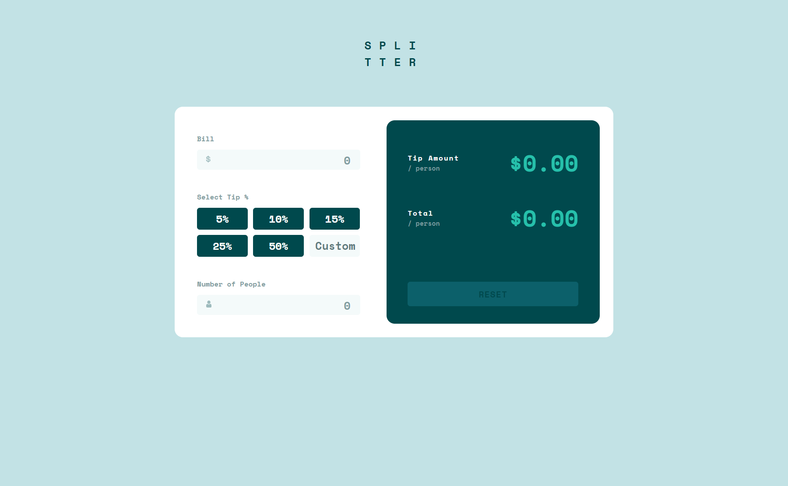
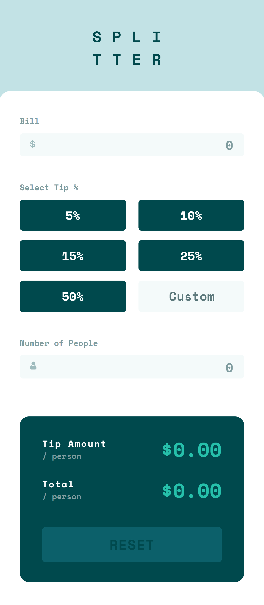

# Frontend Mentor - Tip calculator app solution

This is a solution to the [Tip calculator app challenge on Frontend Mentor](https://www.frontendmentor.io/challenges/tip-calculator-app-ugJNGbJUX). Frontend Mentor challenges help you improve your coding skills by building realistic projects.

## Table of contents

- [Overview](#overview)
  - [The challenge](#the-challenge)
  - [Screenshot](#screenshot)
  - [Links](#links)
- [My process](#my-process)
  - [Built with](#built-with)
  - [What I learned](#what-i-learned)
- [Author](#author)

## Overview

### The challenge

Users should be able to:

- View the optimal layout for the app depending on their device's screen size
- See hover states for all interactive elements on the page
- Calculate the correct tip and total cost of the bill per person

### Screenshot

### Links

- Solution URL: [Solution URL](https://www.frontendmentor.io/solutions/tip-calculator-app-ka7T833blc)
- Live Site URL: [Live site URL](https://falarzedu.github.io/Frontend-Mentor-Challenges/Challenges/Junior%20Level/04%20-%20Tip%20calculator/)

## My process

### Built with

- Semantic HTML5 markup
- CSS custom properties
- Flexbox
- JavaScript

### What I learned

This project was either a good opportunity to reinforce my knowledge of JavaScript and to have some fun while doing so. The biggest problem I have had with this challenge was preventing the display of "NaN", "null" and other stuff than numbers on some occasions, but I could easily fix it by doing some checks like this: 

` if ((elmValue > -Infinity && elmValue < Infinity) ... ) { proceeds to take data and show the results } `

This basically verifies if the variable is or is not between negative and positive infinite, which means it would be a number.

## Author

- Frontend Mentor - [@ETUUU](https://www.frontendmentor.io/profile/ETUUU)

  
